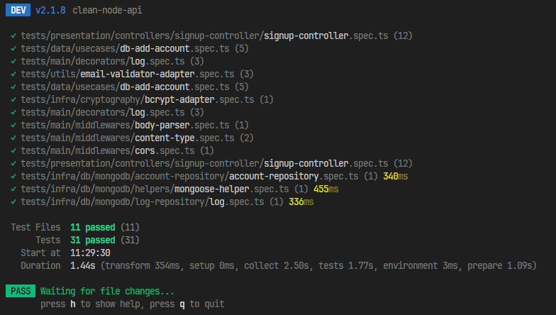

# Clean TS API

This API is being created to later serve my main Medinik project.

Here in this project, practices such as TDD and Clean Architecture are being used.

## Installation 
#### 1. Clone github project
Firstly you can clone the repository in your desktop

```bash
mkdir clean-node-api
cd clean-node-api
git clone https://github.com/rapon1kt/clean-node-api.git .
```

#### 2. Setting Environment Variables
Before installing the packages and running the website there are some variables to be set. All of these variables below will be necessary for database to work proprely. 
|  Variables| Type | Value | 
|--|--|--|
|MONGO_URL | `string` | `url of mongodb`
|PORT | `number`| `normally 3000`

After setting all of them, you can finally start the project.

### 3. Tests
After install the dependencies, run the test command:

```bash
npm test
```
In this project I am using the Vitest library to perform simultaneous tests, if you have any questions about the process, [click here](https://vitest.dev/guide/).
If everything goes well with the tests, the console output should look like this.



If you want to know more detailed aspects about this output, you can find it [here](https://vitest.dev/guide/reporters.html).

#### 4. Running
After running the tests, run the development command:
```bash
npm run dev
```

The project will run on the link:
```bash
http://localhost:[YOUR_PORT]
```

## Contributing 💡

Pull requests are welcome. For major changes, please open an issue first
to discuss what you would like to change.
